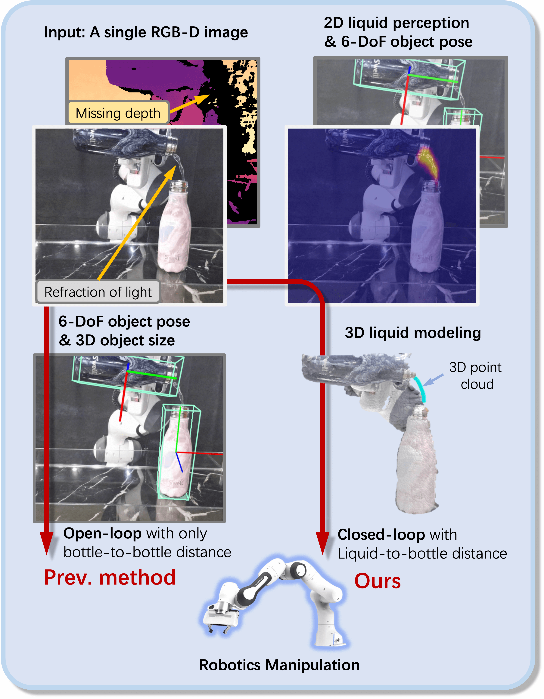

# PourIt!: Weakly-Supervised Liquid Perception from a Single Image for Visual Closed-Loop Robotic Pouring



## 📝 Overview
This repository contains the PyTorch implementation of the paper "PourIt!: Weakly-Supervised Liquid Perception from a Single Image for Visual Closed-Loop Robotic Pouring"
[[PDF](https://openaccess.thecvf.com/content/ICCV2023/papers/Lin_PourIt_Weakly-Supervised_Liquid_Perception_from_a_Single_Image_for_Visual_ICCV_2023_paper.pdf)]
[[Supp](https://openaccess.thecvf.com/content/ICCV2023/supplemental/Lin_PourIt_Weakly-Supervised_Liquid_ICCV_2023_supplemental.zip)]
[[arXiv](https://arxiv.org/pdf/2307.11299.pdf)].
Our approach could recover the 3D shape of the detected liquid.

For more results and robotic demos, please refer to our [Webpage](https://hetolin.github.io/PourIt/).
<div class="half" style="text-align: center;">
    
</div>

## 📚 Dependencies
* Python >= 3.6
* PyTorch >= 1.7.1
* CUDA >= 10.1


## ⚙️ Installation
```
conda create -n pourit python=3.6
conda activate pourit

pip install -r requirements.txt
```

## 📊 Prepare Dataset
### Using PourIt! dataset

Download [PourIt! dataset](https://drive.google.com/file/d/1X_IyPt9N9-AtqVwHWrL5nVqIuNMileTY/view?usp=share_link).
Unzip and organize these files in `./data` as follows,
```
data
└── PourIt
    ├── seen
    └── unseen
```

### Optional: Using your own dataset

If you want to use your own data, please organize the files as follows,
```
data
└── PourIt_additional
    ├── ori_scene1
    │    ├── water
    │    │    ├── 000000_rgb.png
    │    │    ├──  ...
    │    │    └── 000099_rgb.png
    │    │
    │    └── water_no
    │        ├── 000000_rgb.png
    │        ├──  ...
    │        └── 000099_rgb.png
    │        
    ├── ori_scene2
    ├── ori_scene3
    ├── ...
    └── ori_scene10
```       
Note: The `water` folder stores the RGB images with flowing liquid, while the `water_no` folder stores the RGB images without flowing liquid. 

Then run the pre-processing code to process your own data (If you are using the PourIt! dataset, please skip this step).
```
# For example, modify the code
SCENE_NUM = 10

# Then execute
python preprocess/process_origin_data.py
```


## ⏳ Training
Download the ImageNet-1k pre-trained weights [mit_b1.pth](https://connecthkuhk-my.sharepoint.com/:f:/g/personal/xieenze_connect_hku_hk/EvOn3l1WyM5JpnMQFSEO5b8B7vrHw9kDaJGII-3N9KNhrg?e=cpydzZ) from the official SegFormer implementation and move them to  `./pretrained`.
```
# train on PourIt! dataset
bash launch/train.sh

# visualize the log
tensorboard --logdir ./logs/pourit_ours/tb_logger --bind_all

# type ${HOST_IP}:6006 into your browser to visualize the training results

# evaluation on PourIt! dataset (seen and unseen scenes)
bash launch/eval.sh 
```

## 🪄 Demo
Download the PourIt! [pre-trained weights](https://drive.google.com/file/d/1OPzdN9lAOjkhDn4JNzB6iCO7XellDSiP/view?usp=share_link) and move it to the `./logs/pourit_ours/checkpoints`

### Demo1 (Online 2D liquid detection)
1. Set up your camera, e.g. kinect_azure or realsense
```
# launch ROS node of kinect_azure camera
roslaunch azure_kinect_ros_driver driver.launch
```

2. Run the `demo.py`
```
python demo.py

# online 2d liquid prediction
predictor.inference(liquid_2d_only=True)
```
Then you will observe the results of 2D liquid detection, similar to the following, 
<div class="half" style="text-align: center;">
    
</div>

### Demo2 (Online 3D liquid detection)
1. Set up your camera, e.g. kinect_azure or realsense
```
# launch ROS node of kinect_azure camera
roslaunch azure_kinect_ros_driver driver.launch
```

2. Launch your pose estimator, e.g. [SAR-Net](https://github.com/hetolin/SAR-Net), to publish the estimated pose transformation of the container `'/bottle'` versus `'/rgb_camera_link'` (kinect_azure) or `'/camera_color_frame'`(realsense)

3. Run the `demo.py`
```
python demo.py

# online 3d liquid prediction
predictor.inference()
```

### Demo3 (Offline 3D liquid detection)
```
# If you don't have a camera available on-the-fly, you can run our example in offline mode.

# offline 3d liquid prediction
predictor.process_metadata_multiple('./examples/src')
```
The reconstructed 3D point cloud of liquid will be saved in `./example/dst`.

## 🔖 Citation
If you find our work helpful, please consider citing:
```
@InProceedings{Lin_2023_ICCV,
    author    = {Lin, Haitao and Fu, Yanwei and Xue, Xiangyang},
    title     = {PourIt!: Weakly-Supervised Liquid Perception from a Single Image for Visual Closed-Loop Robotic Pouring},
    booktitle = {Proceedings of the IEEE/CVF International Conference on Computer Vision (ICCV)},
    month     = {October},
    year      = {2023},
    pages     = {241-251}
}
```

## 🌹 Acknowledgment
Our implementation leverages the code from [AFA](https://github.com/rulixiang/afa). Thanks for the authors' work.  We also thank <a href="https://storage.googleapis.com/www.connorschenck.com/index.html">Dr. Connor Schenck</a>
            for providing the <a href="https://rse-lab.cs.washington.edu/lpd/">UW Liquid Pouring Dataset.